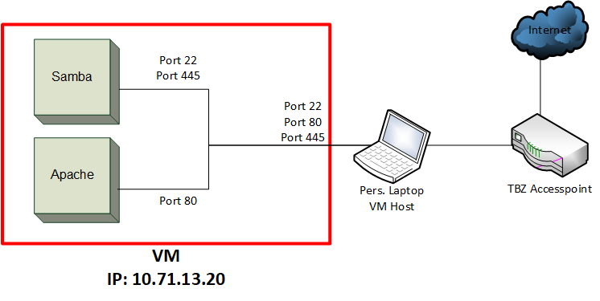
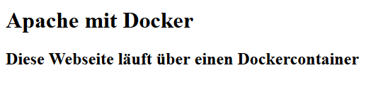

# M300-LB02
## Einleitung
In der zweiten LB arbeiten wir mit Docker. Ich habe die Vorlage von Herrn Berger genommen, die eine VM mit Docker automatisch installiert.
Ich werde wieder Versuchen einen Webserver und Samba zu installieren. Diesmal natürlich mit Docker
***

## Servicebeschreibung
Wie schon erwähnt, werde ich wieder versuchen **Samba** und zusätzlich einen **Apache** Webserver zu installieren. Ich werde wieder zwei Ordner freigeben und diese unterschiedlich berechtigen. 
Für die Berechtigungen werden zwei Benutzer erstellt, welche je nur auf einen der beiden Ordner Zugriffsrechte haben.    
Der Apache wird einen kleine custom Webseite anzeigen, und im über Samba werden die genannten Ordner ersichtlich sein.
***

## Technische Angaben

### Netzwerkplan
 

### Betrieb
Die VM wird mit Vagrant aufgesetzt, damit alle benötigten Ports freigegeben sind. Die Docker mit den benötigten Dateien liegen jeweils im **apache**- und **samba** Ordner.  
Beide Container sind in einem Dockerfile definiert und werden über ein `Dockercompose.yml` so in Betrieb genommen.   
Damit man die Service benützen kann, müssen ebenfalls im Docker die Ports freigegeben werden.     

1. Zuerst muss natürlich die VM geestartet werden. Dies macht man mit `vagrant up`.
2. Dann gehen Sie ins Vagrant-Directory:         `cd /vagrant`
3. Danach müssen die Container gebuildet werden: `docker-compose build`
4. ZUm Schluss muüssen Sie noch gestartet werden:   `docker-compose up -d`

#### Anderer Befehle
Docker öffnen:                        `docker exec -it apache /bin/bash`    
Docker stoppen:                       `docker stop apache`
Docker herunterfahren und löschen:    `docker-compose down` 
Docker löschen:                       `docker rm apache`  

#### smb.conf
Die Konfigurationsdatei von Samba wird vom Client lokal dem Docker übergeben und überschreibt dann die Standardkonfiguration von Samba. Die smb.conf sieht wie folgt aus:

```Properties
[global]
        map to guest = Bad User
        log file = /var/log/samba/%m
        log level = 10

[guest]
        comment = Foldershare
        path = /Shared/
        read only = no
        guest ok = yes
        writeable = yes

[html]
        comment = Foldershare for web
        path = /web/
        read only = yes
        guest ok = yes
        writeable = no
```
### Dockerfiles
Ich arbeite mit einem Docker-Compose File, mit diesem können mehrere Container aufs Mal aufgesetzt werden. Ich erstelle zwei Container, einen Webserver und einen Sambaserver.
#### Docker-Compose
```yml
version: '2'

services:
  samba:
    container_name: samba
    tty: true
    network_mode: bridge
    volumes:
      - ./samba/Share/:/Shared
      - ./apache/web:/web
    ports:
      - "445:445"
      - "139:139"
    build:
      context: .
      dockerfile: /samba/Dockerfile

  web:
    container_name: apache
    tty: true
    network_mode: bridge
    volumes:
      - ./apache/web:/var/www/html
    ports:
      - "80:80"
    build:
      context: .
      dockerfile: /apache/Dockerfile
```
#### Apache
Aus der Vorlage von M. Berger.
```Dockerfile
FROM ubuntu:latest
MAINTAINER Mischa Wolf

# Install Apache
RUN apt-get update
RUN apt-get -q -y install apache2 

# Configure Apache
ENV APACHE_RUN_USER www-data
ENV APACHE_RUN_GROUP www-data
ENV APACHE_LOG_DIR /var/log/apache2

RUN mkdir -p /var/lock/apache2 /var/run/apache2 \
&& rm /var/www/html/index.html

# Expose Port 80
EXPOSE 80

CMD /bin/bash -c "source /etc/apache2/envvars && exec /usr/sbin/apache2 -DFOREGROUND"
```
#### Samba
```Dockerfile
FROM alpine:latest
MAINTAINER Mischa Wolf

# Install Samba and Bash
RUN apk add --no-cache --update \
    samba-common-tools \
    samba-client \
    samba-server \
    bash

# Copy smb.conf
COPY /samba/smb.conf /etc/samba/smb.conf

# Expose Ports 445 / 139
EXPOSE 445/tcp 139/tcp

CMD ["smbd", "--foreground", "--no-process-group", "--log-stdout"]
```
***

## Testing
| Service | Testfall | Beschreibung | Resultat |
|:--:|:--:|:--|:--|
| Webserver | Webseite erreichbar | Browser öffnen<br>**http://10.71.13.20** | Webseite kann aufgerufen werden<br>*Siehe Bild 1* |
| Samba | Samba erreichbar | Windows Explorer öffnen<br> **\\\10.71.13.20** | Freigegebene Ordner<br>werden angezeigt<br>*Siehe Bild 2* |
| Samba | Berechtigung<br>guest | Windows Explorer öffnen<br> **\\\10.71.13.20\guest**<br>Alle sind Berechtigt. Gast-Zugang | Gast-Zugang funktioniert |
| Samba | Berechtigung<br>html | Windows Explorer öffnen<br> **\\\10.71.13.20\html**<br>Nur Benutzer "samba" ist berechtigt | Konnte keine Benutzerrechte vergeben in Alpine :( |

**Webserver**   


**Samba Freigabe**  
  
***

## Troubleshooting
### Sambacontainer wird direkt wieder heruntergefahren
Um dies zu lösen, musste ich beim starten das Attribut `--no-process-group` hinzufügen.

```Dockerfile
CMD ["smbd", "--foreground", "--no-process-group", "--log-stdout"]
```

### Docker-Compose.yml
Es wurden die Volumes nicht richtig angebunden. Ich musste den `.` vor den Pfad machen.
```yml
    volumes:
      - ./apache/web:/var/www/html
```